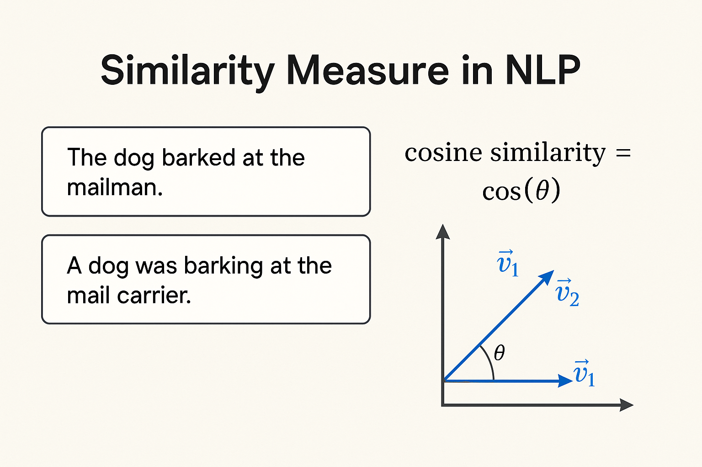
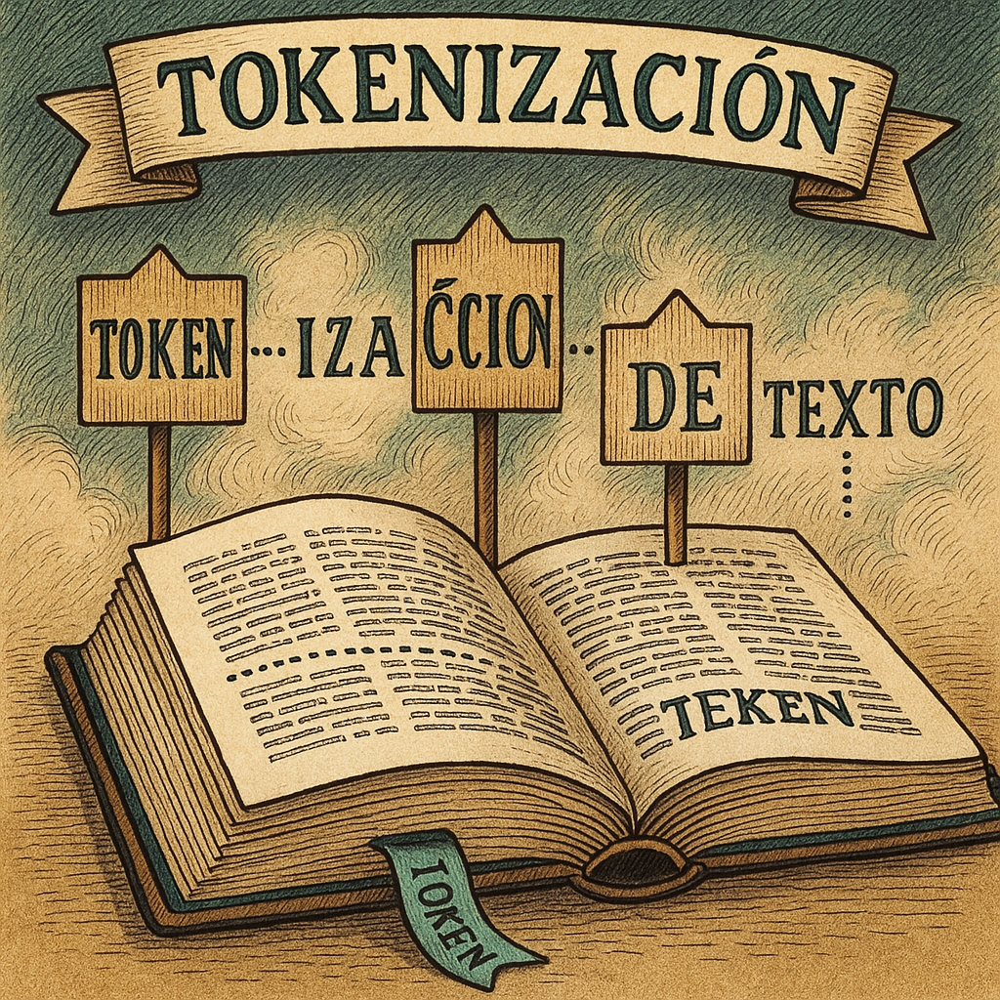

# Especialización en Inteligencia Artificial · CEIA · FIUBA

# Desafíos de Procesamiento de Lenguaje Natural

---

## Alumno

* Ojeda, Juan Cruz · CEIA 19co2024

---

## Contenido

### Desafío 1: Similaridad coseno



* [Notebook: Similaridad coseno](Desafio_1/Desafio_1_OJEDA.ipynb)

Se empleó un dataset en inglés y se midió la similaridad entre documentos utilizando la métrica de **similaridad coseno**.

---

### Desafío 2: Embeddings de caracteres y palabras


* [Notebook: Embeddings](Desafio_2/Desafio_2_OJEDA.ipynb)

**Objetivo:** a partir de un libro en español, se generaron embeddings de caracteres y palabras, comparando ambas representaciones.

---

### Desafío 3: Tokenización



* [Preprocesamiento de datos](Desafio_3/Desafio_3a_preprocesamiento_OJEDA.ipynb)
* [Modelo Lenguaje SimpleRNN](Desafio_3/Desafio_3b_SimpleRNN_OJEDA.ipynb)
* [Modelo Lenguaje LSTM](Desafio_3/Desafio_3c_LSTM_OJEDA.ipynb)

**Objetivo:** se implementó la tokenización de caracteres y palabras sobre un corpus en español, comparando el desempeño de ambos modelos.

---

### Desafío 4: LSTM Bot QA


* [Notebook: Bot QA](Desafio_4/Desafio_4_OJEDA.ipynb)

**Objetivo:** con datos del challenge **ConvAI2** (Conversational Intelligence Challenge 2) se construyó un bot encoder–decoder con LSTM capaz de responder preguntas (QA) en inglés.

Archivos complementarios:

* `data_volunteers.json`: dataset base
* `encoder_plot.png`, `decoder_plot.png`, `model_plot.png`: arquitecturas exportadas
* Embeddings de GloVe (`gloveembedding.pkl`, no versionado)

---

## Requisitos de entorno

* Python **3.10.11**
* Librerías principales: `tensorflow/keras`, `numpy`, `pandas`, `scikit-learn`, `matplotlib`, `tqdm`
* Para visualización de modelos: `pydot` y `graphviz`

---

## Ejecución

1. Clonar el repositorio.
2. Instalar dependencias:

   ```bash
   pip install -r requirements.txt
   ```
3. Abrir cada notebook en su carpeta correspondiente utilizando Jupyter Notebook, Jupyter Lab o cualquier editor compatible (por ejemplo VSCode con la extensión de Jupyter).

---
